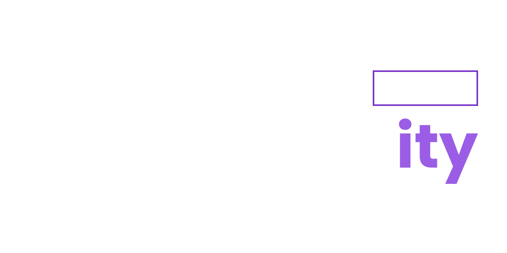

[![Contributors][contributors-shield]][contributors-url]
[![Forks][forks-shield]][forks-url]
[![Stargazers][stars-shield]][stars-url]
[![Issues][issues-shield]][issues-url]
[![MIT License][license-shield]][license-url]
[![LinkedIn][linkedin-shield]][linkedin-url]

<!-- PROJECT LOGO -->
<br />
<p align="center">
  <a href="https://componentity.com">
    
  </a>

  <h3 align="center">Componentity - Boilerplates</h3>

  <p align="center">
    nextjs + react-content-loader + react-html-parser + next-pwa + next-sitemap + nprogress + tailwindcss
    <br />
    <br />
    ·
    <a href="https://github.com/componentity/nexttailpwa/issues">Report Bug</a>
    ·
    <a href="https://github.com/componentity/nexttailpwa/issues">Request Feature</a>
  </p>
</p>

### Built With

|                                                     Nextjs                                                     |                               TailwindCSS                               |                                                     React Content Loader                                                      |
| :------------------------------------------------------------------------------------------------------------: | :---------------------------------------------------------------------: | :---------------------------------------------------------------------------------------------------------------------------: |
|  |  |  |

|                                  NProgress                                  |                                  Next-PWA                                  |                                  Next-Sitemap                                   |
| :-------------------------------------------------------------------------: | :------------------------------------------------------------------------: | :-----------------------------------------------------------------------------: |
|  |  |  |

|                                 React-Html-Parser                                 |
| :-------------------------------------------------------------------------------: |
|  |

<!-- GETTING STARTED -->

## Getting Started

1. Clone the repo
   ```sh
   git clone https://github.com/componentity/nexttailpwa.git
   ```
2. cd to the directory (nexttailpwa)
   ```sh
   cd nexttailpwa
   ```
3. Install NPM packages
   ```sh
   npm install
   ```
4. Happy Coding :smile:
<!-- USAGE EXAMPLES -->

## Usage

Do not need to do all the basic npm installs for a Tailwind + Nextjs App with PWA and Sitemap Configurations all over again and again. Just clone the repo!

_For more examples, please refer to the [Componentity](https://componentity.com)_

<!-- CONTRIBUTING -->

## Contributing

Contributions are what make the open source community such an amazing place to learn, inspire, and create. Any contributions you make are **greatly appreciated**.

1. Fork the Project
2. Create your Feature Branch (`git checkout -b feature/AmazingFeature`)
3. Commit your Changes (`git commit -m 'Add some AmazingFeature'`)
4. Push to the Branch (`git push origin feature/AmazingFeature`)
5. Open a Pull Request

<!-- LICENSE -->

## License

Distributed under the MIT License. See `LICENSE` for more information.

<!-- CONTACT -->

## Contact

Mr. Code - [@mymakarim](https://twitter.com/mymakarim) - ymakarim@gmail.com
Meh Mohammadi - [@mehmoh41](https://github.com/mehmoh41) - moh.meh41@gmail.com

Project Link: [https://github.com/componentity/nexttailpwa](https://github.com/componentity/nexttailpwa)

<!-- MARKDOWN LINKS & IMAGES -->
<!-- https://www.markdownguide.org/basic-syntax/#reference-style-links -->

[contributors-shield]: https://img.shields.io/badge/contributers-2-green.svg?style=for-the-badge
[contributors-url]: https://github.com/componentity/nexttailpwa/graphs/contributors
[forks-shield]: https://img.shields.io/badge/forks-2-blue.svg?style=for-the-badge
[forks-url]: https://github.com/componentity/nexttailpwa/network/members
[stars-shield]: https://img.shields.io/badge/stars-2-yellow.svg?style=for-the-badge
[stars-url]: https://github.com/componentity/nexttailpwa/stargazers
[issues-shield]: https://img.shields.io/badge/issues-0-orange.svg?style=for-the-badge
[issues-url]: https://github.com/componentity/nexttailpwa/issues
[license-shield]: https://img.shields.io/badge/license-MIT-green.svg?style=for-the-badge
[license-url]: https://github.com/componentity/nexttailpwa/blob/master/LICENSE.txt
[linkedin-shield]: https://img.shields.io/badge/-LinkedIn-black.svg?style=for-the-badge&logo=linkedin&colorB=555
[linkedin-url]: https://linkedin.com/in/mymakarim
